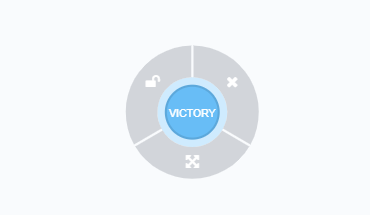
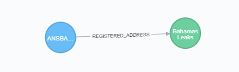

.. Paradise Paper Search documentation master file, created by
   sphinx-quickstart on Tue Jan 23 15:25:27 2018.
   You can adapt this file completely to your liking, but it should at least
   contain the root `toctree` directive.

===================================================================
Welcome to Paradise Paper Search App's Django + Neomodel Tutorial!
===================================================================

Overview
--------

The aim of this tutorial is to demonstrate how to develop a web application using the Django 
framework backed by Neo4j, connecting them with the Neomodel driver. Neomodel is an Object Graph 
Mapper (OGM) for the Neo4j graph database.

The tutorial covers several topics, some of them are: how to configure Neomodel within a Django 
program, create models, query to the database, create an API. It provides best-practice guidance
on implementing Neomodel.

The project is a web application to search for information on a Paradise Paper Graph Database. 
The data from the Database includes companies and people in more than 200 countries that are part 
of the Paradise Papers, Panama Papers, Bahama Leaks or the Offshore Leaks investigations.

The search of the program can filter the mentioned data by country, jurisdiction and/or data source. 
The approach adopted to make the program was to create a single-page web application, in which 
the data that is displayed will be obtained from an API. The API will fetch the data from the Neo4j 
database and return it as a JSON. This allows you to retrieve fast segments of data in several 
smaller requests, instead of making a single large request.

The types of data you can encounter when searching are: Entity, Officer, Intermediary, Address,
Other. Each of these data records is displayed as a `Node` within the graph database. If you are
not familiar with the definition of a node, it is a graphic data record. Here is an example: 

In a graph database, nodes are linked with each other with lines; they represent the relationship
between them. This term is called a `edges` or `relationships`. On this application there are offshore entities that
have a registered address; Therefore there is a relationship type called `REGISTERED_ADDRESS`. 

In this example we can see a offshore entity register to an address on the bahamas.

What’s more, each node will have `properties`, which are essentially labels that are applied to 
a record. For example, an Entity node might have a label country with the value of "Bahamas". 
Having these labels allows the system to find all the nodes that are in "Bahamas", instead of the
ones that are in "Canada" or "Mexico". The properties can be compared as columns in SQl databases.

.. toctree::
   :maxdepth: 2
   :glob:
   :numbered:
   :caption: Contents:

   tutorial/*

