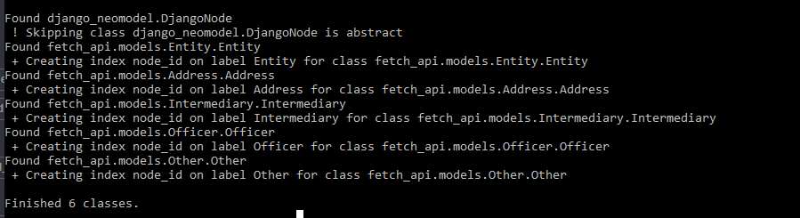

==============================
How to create the base models.
==============================

Create a new app for the API: 
==============================
Right now, we need to create a Django app which is going to be used to create the search API and,
with it, we will define our models classes.

To create this new app, we must run this command: 

``python manage.py startapp fetch_api``

Where ``fetch_api`` is the name of the application we are creating; however, you can use the name of your preference.  This will create a new folder inside the Django project directory, and the structure
of it is: ::

    ├── fetch_api/
    │   ├── __init__.py
    │   ├── admin.py
    │   ├── apps.py
    |   ├── models.py
    │   ├── migrations/
    │   │   └── __init__.py 

Now we need to create a file called `urls.py` inside the application we just created. Right now we
are only going to add the following code::

    from django.conf.urls import url

    urlpatterns = []

As we go on in this tutorial, we will start adding the endpoint urls, but for now we only need to
have the empty urlpattern list.

The next step is to register the fetch_api URLconf into the root project URLconf.  We need to open
the file paradise_papers_search/urls.py. Afterwards, we have to add ``url(r'^fetch/',
include('fetch_api.urls', namespace='fetch_api')),``   inside the urlpatterns list. After completing
these steps the file should look like this::

    from django.conf.urls import url, include from django.contrib import admin from
    django.views.generic import TemplateView

    urlpatterns = [ url(r'^admin/', admin.site.urls), url(r'^$',
    TemplateView.as_view(template_name='index.html'), name='index'), url(r'^fetch/',
    include('fetch_api.urls', namespace='fetch_api')), ]

Create The Models Directory:
==============================

On The ``fetch_api`` folder, first, we need to remove the ``models.py`` file. Then we need to create
a new folder called ``models``.  Inside the folder, we will need to add the files with the 
structure of the nodes. Each file will have the essential fields and methods of the data stored 
in Neo4j database. 

.. [*] Note: Before we start creating our models we need to create a  ``__init__.py`` file inside the model’s folder so Python treat the directory as a package.

Start creating The Models Files:
===================================
To start we will create an ``entity.py`` file: 

1. The first step is to add the imports needed::

    from neomodel import (
        StringProperty,
        StructuredNode,
        RelationshipTo,
        RelationshipFrom,
        Relationship
    )

2. Create a class for the node called Entity. We are connecting to a Neo4j database instead of the
regular Django database; therefore, we are going to use  ``StructuredNode``. This is the equivalent 
of ``models.Model`` which is usually used when creating a Models class in Django. When using 
``StructuredNode`` , neomodel automatically creates a label for each class using it with the 
corresponding indexes and constraints.

.. [*] Note: If you need a model to work like ``ModelForm``, you will need to change ``StructuredNode`` to ``DjangoNode``. Also, you will need to add a ‘Meta’ class. For more reference see the documentation for django-neomodel_

    .. _django-neomodel: https://github.com/neo4j-contrib/django-neomodel

    ``class Entity(StructuredNode):``

3. The next step is to add the properties for the node. Each node property in the Neo4j database
should be a property in the model class.

The properties of the ``Entity`` node in the database have the following scheme::

        {
          "sourceID": "Panama Papers",
          "address": "MEI SERVICES LIMITED ROOM E; 6TH FLOOR; EASTERN COMMERCIAL CENTRE; 395-399 HENNESSY ROAD HONG KONG",
          "jurisdiction": "SAM",
          "service_provider": "Mossack Fonseca",
          "countries": "Hong Kong",
          "jurisdiction_description": "Samoa",
          "valid_until": "The Panama Papers data is current through 2015",
          "ibcRUC": "25475",
          "name": "JIE LUN INVESTMENT LIMITED",
          "country_codes": "HKG",
          "incorporation_date": "10-APR-2006",
          "node_id": "10000020",
          "status": "Active,
        }

Therefore, the structure of the ``Entity`` class should be::

    class Entity(StructuredNode):
        sourceID                           = StringProperty()
        address                            = StringProperty()
        jurisdiction                       = StringProperty()
        service_provider                   = StringProperty()
        countries                          = StringProperty()
        jurisdiction_description           = StringProperty()
        valid_until                        = StringProperty()
        ibcRUC                             = StringProperty()
        name                               = StringProperty()
        country_codes                      = StringProperty()
        incorporation_date                 = StringProperty()
        node_id                            = StringProperty(index = True)
        status                             = StringProperty()

On our case, the database we are using only have string values for the properties. However, there
are several types of properties available; such as, IntegerProperty, ArrayProperty, DateProperty.
In case you need to know more about this, go to this link_

    .. _link: http://neomodel.readthedocs.io/en/latest/properties.html

4. Add the relationships for the node::

    officers                 = RelationshipFrom('.officer.Officer', 'OFFICER_OF')
    intermediaries           = RelationshipFrom('.intermediary.Intermediary', 'INTERMEDIARY_OF')
    addresses                = RelationshipTo('.address.Address', 'REGISTERED_ADDRESS')
    others                   = RelationshipFrom('.other.Other', 'CONNECTED_TO')
    entities                 = Relationship('.entity.Entity', None)

.. [*]  You can find all the nodes relation by opening your local database, click HERE_ to access it. When you get inside, run the command ``CALL db.schema()`` on the search bar to display the relationships.  note: you need to have it up and running to work. 

    .. _HERE: http://localhost:7474/browser/ 

How **RelationshipFrom** , **RelationshipTo** and **Relationship** work:

        1. The first parameter is the type of node you want to connect. e.g ``.officer.Officer``
        2. The second parameter is the relationship type. e.g. ``OFFICER_OF``. If you do not know the relationship type you need to connect, you can use ``None``. Neomodel would be responsible for looking for any direct connection between the two nodes.

* **RelationshipFrom** is an INCOMING relationship. ({node})<-[relation_ident:relation_type]-({node_connected})
* **RelationshipTo** is an OUTGOING relationship. ({node})-[relation_ident:relation_type]->({node_connected})
* **Relationship** which can be either way. ({node})-[relation_ident:relation_type]-({node_connected})

If **RelationshipFrom** be illustrated, the output would be something like: 

We have to repeat these steps for each node class we wish to create. On this program, those would be:
``address.py``, ``intermediary.py``, ``officer.py``, and ``other.py``. We must add the following
code to each of the files:

address.py ::

    from neomodel import (
        StringProperty,
        StructuredNode,
        RelationshipFrom,
    )

    class Address(StructuredNode):
        sourceID       = StringProperty()
        country_codes  = StringProperty()
        valid_until    = StringProperty()
        address        = StringProperty()
        countries      = StringProperty()
        node_id        = StringProperty(index = True)
        officers       = RelationshipFrom('.officer.Officer', 'REGISTERED_ADDRESS')
        intermediaries = RelationshipFrom('.intermediary.Intermediary', 'REGISTERED_ADDRESS')   

intermediary.py::

    from neomodel import (
        StringProperty,
        StructuredNode,
        RelationshipTo,
        Relationship
    )

    class Intermediary(StructuredNode):
        sourceID      = StringProperty()
        valid_until   = StringProperty()
        name          = StringProperty()
        country_codes = StringProperty()
        countries     = StringProperty()
        node_id       = StringProperty(index = True)
        status        = StringProperty()
        entities      = RelationshipTo('.entity.Entity', 'INTERMEDIARY_OF')
        addresses     = RelationshipTo('.address.Address', 'REGISTERED_ADDRESS')
        officers      = Relationship('.officer.Officer', None)

officer.py::

    from neomodel import (
        StringProperty,
        StructuredNode,
        RelationshipTo,
        Relationship,
    )

    class Officer(StructuredNode):
        sourceID      = StringProperty()
        name          = StringProperty()
        country_codes = StringProperty()
        valid_until   = StringProperty()
        countries     = StringProperty()
        node_id       = StringProperty(index = True)
        addresses     = RelationshipTo('.address.Address', 'REGISTERED_ADDRESS')
        entities      = RelationshipTo('.entity.Entity', 'OFFICER_OF')
        officers      = Relationship('.officer.Officer', None)

other.py::

    from neomodel import (
        StringProperty,
        StructuredNode,
        RelationshipTo,
        Relationship,
        Relationship
    )

    class Other(StructuredNode):
        sourceID    = StringProperty()
        name        = StringProperty()
        valid_until = StringProperty()
        node_id     = StringProperty(index = True)
        countries   = StringProperty()
        addresses   = RelationshipTo('.address.Address', 'REGISTERED_ADDRESS')
        officers    = Relationship('.officer.Officer', None)
        entities    = Relationship('.entity.Entity', None)

Modify the __init__.py file:
==================================
Now we are going to add code to the __init__.py. ::

    from .entity import Entity
    from .address import Address
    from .intermediary import Intermediary
    from .officer import Officer
    from .other import Other

This is done to simplify the imports. If you are familiar with Django and having only one model
file, you might remember the imports are done like : from `.models import *` or any class you might
need. Nevertheless, we have the classes inside a package call `models`, because of this if we need to
import a class we have to say, for example `from .models.officer import Officer`. This is because
we are one level down. 

However, since we took the approach of having the imports on the `__init__.py` file, now we can
import them as `from .models import Officer`

Create constraints or indexes: 
==================================

Creating constraints and labels have to be done after adding/changing the node definitions.
The command that we will need to use is: 

    ``python manage.py install_labels``

In this case, since we added `index=True` on the node_id property the output would create indexes
on each of the property mentioned:

.. [*]  Note: manage.py intall_labels works like manage.py migrate

If it were a completely new database, Neomodel would also have created the node labels, properties
and relationships.

After doing these steps, the structure folder of the project changed. Right now the structure of the
fetch_api app should be::

    ├── fetch_api/
    │   ├── __init__.py
    │   ├── admin.py
    │   ├── apps.py
    │   ├── urls.py
    │   ├── migrations/
    │   │   └── __init__.py
    │   ├── models/
    │   │   ├── __init__.py
    │   │   ├── address.py
    │   │   ├── entity.py
    │   │   ├── intermediary.py
    │   │   ├── officer.py
    │   │   └── other.py
